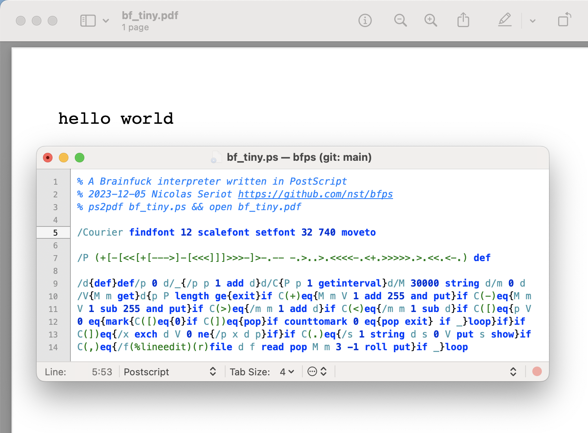

# bfps
A Brainfuck interpreter written in PostScript

This program aims at being accurate, readable and minimal.

That's why it comes in three flavors:

    bf_long.ps  - full version, debug tools, unit tests
    bf.ps       - readable version
    bf_tiny.ps  - minimal, golfed version

